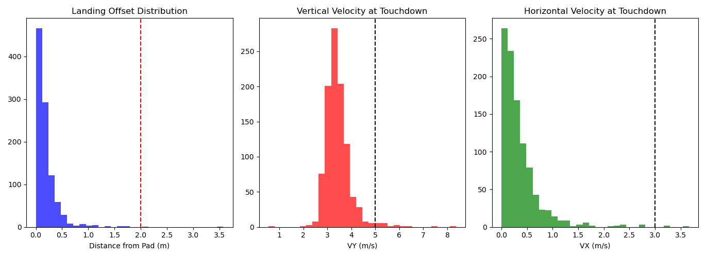

# KATA-MPC: Phased Predictive Aerospace Controller

**KATA-MPC** (Kinematic Adaptive Trajectory Algorithm - Model Predictive Controller) is an independently developed guidance framework for autonomous rocket recovery. It utilizes a three-phase transition—from aerodynamic steering to a multi-stage throttled landing burn—to achieve precision landings under stochastic environmental disturbances.

## 🚀 Research Performance
*   **Probability of Mission Success (PMS):** 97.00% (Validated via N=1000 Monte Carlo Simulation).
*   **Mean Precision:** Landing offset of ~0.20m.
*   **Vertical Stability:** Mean $V_y$ of 3.47 m/s (Threshold: < 5.0 m/s).
*   **Horizontal Stability:** Mean $V_x$ of 0.35 m/s (Threshold: < 3.0 m/s).

## 📊 Statistical Validation
The following histograms represent the terminal state distribution of 1,000 simulated landings under 15 m/s Gaussian wind gusts and sensor noise.

  
   <i>Figure 1: Monte Carlo results showing Landing Offset (Left), Vertical Velocity (Center), and Horizontal Velocity (Right). Dashed lines represent mission-critical safety thresholds.</i>

## 🛠 Methodology
The **KATA-MPC** framework addresses the non-linear challenge of "suicide burns" with high-latency computational hardware:
1.  **Aero-Correction Phase:** Dynamic optimization of Angle of Attack (AoA) to align the trajectory with the landing pad using atmospheric lift.
2.  **Predictive Ignition:** A heuristic-based law that calculates the optimal ignition point based on real-time mass-altitude-velocity (MAV) data.
3.  **Throttled Descent:** High-frequency (100Hz) feedback loop to minimize terminal drift and ensure soft touchdown.

## 💻 Technical Implementation
*   **Language:** Python.
*   **Libraries:** NumPy (Vector math), Matplotlib (Analysis).
*   **Physics Engine:** Custom-built model including altitude-dependent density, variable $I_{sp}$, and mass loss dynamics.

## 📝 About the Author
Developed by a 16-year-old independent researcher, black belt karate athlete, and national medalist. This project serves as a case study in applying the discipline and iterative refinement of martial arts to computational aerospace engineering.

---
